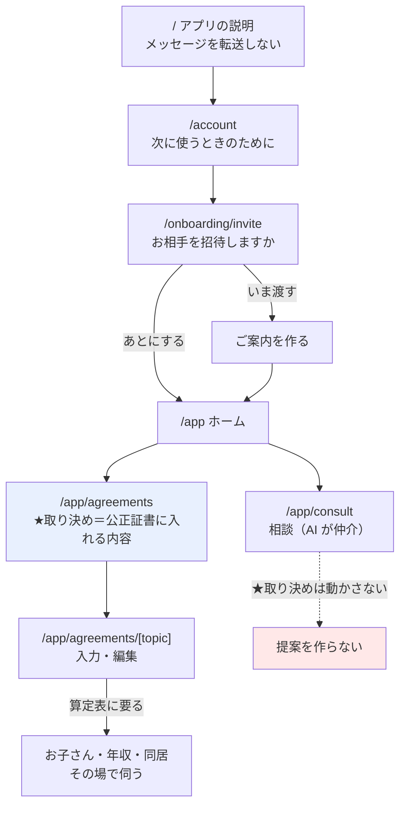

# 設計：取り決めは「入力」で作る

- 対応する要求：`requirements.md`
- 作成日：2026-08-12

---

## 1. 全体像



### 1.1 ★ 二つの経路を、はっきり分ける

| | 取り決め | 相談 |
| --- | --- | --- |
| 作る人 | **本人が入力する** | AI が仲介する |
| AI の関与 | **無い** | 受け止めと取次ぎ |
| 公正証書 | **載る** | 載らない |
| 帰結 | AgreementItem | 取次ぎ／Adjustment |

---

## 2. オンボーディング

### 2.1 3枚だけにする

| 画面 | 内容 |
| --- | --- |
| `/` | アプリの説明。**「書いた言葉は、そのままお相手に届きません」** |
| `/account` | 次に使うときのためのメール登録。**飛ばせる** |
| `/onboarding/invite` | **お相手を招待しますか**（いま渡す／あとにする） |

### 2.2 消すもの

- `/start`（状況の5択）… **全員が入力から始まるので、分岐する意味が無い**
- `/onboarding/living`・`/onboarding/children`・`/onboarding/profile`
  … **取り決め画面に移す**

> ★ 削除ではなく**移設**。画面と API は残し、
> 取り決めの入力から呼ぶ。既存の実装を捨てない。

### 2.3 招待をオンボーディングに戻すことの扱い

第3弾の設計は「聞いた時点で、アプリが相手に伝える前提でいることが伝わる」として外していた。
戻すにあたり、当時の懸念に対して次を守る。

- 関係の状態（話しているか等）は**一切聞かない**
- 「あとにする」を**同じ重さ**で置く（枠線・面積・文字サイズを揃える）
- 「**お渡しになるまで、お相手には何も届きません**」をその場に書く

---

## 3. 取り決め画面

### 3.1 一覧（`/app/agreements`）

**4つの論点を並べる。**状態を1行で添える（相談一覧と同じ規律：数字を出さない）。

```
養育費            未入力 ／ こちらの記録 ／ お相手のご意向待ち ／ 合意済
面会交流          〃
財産分与          〃
年金分割          〃
```

- **扱えない論点を出さない**（慰謝料・親権者・婚姻費用・離婚への同意）
- 何も無いときは L-2 の空の状態（「全部を決める必要は、ありません。」）
- 各行 → `/app/agreements/[topic]`

### 3.2 入力・編集（`/app/agreements/[topic]`）

| 状態 | 出るもの |
| --- | --- |
| 未入力 | 入力フォーム |
| こちらの記録 | 入力した内容 ＋ **直す** |
| お相手のご意向待ち | 同上 ＋「お相手が同じ内容を記録されると、合意になります」 |
| 内容が異なる | **双方の内容を並べる** ＋ 算定表の範囲（養育費のみ） |
| 合意済 | N-1 の表示 ＋ **変更を申し出る**（K-6） |

### 3.3 ★ 必要な情報を、必要になった時点で聞く

養育費の入力を開いたとき、算定表に要る情報が欠けていれば**その場で伺う**。

```
養育費を入力する
  ↓ お子さんが未登録
  お子さんのこと（人数・生まれ年月）      ← /onboarding/children を再利用
  ↓ 同居が未回答
  同居（受け取る側を決めるためだけ）      ← /onboarding/living を再利用
  ↓ 年収が未入力
  年収（帯に変換して見せる）              ← /onboarding/profile を再利用
  ↓
  金額・支払日・終期
```

- **いずれも飛ばせる。**飛ばした場合、算定表の範囲が出ないだけ
- **「目安が出ないと決められません」とは書かない**（実質的な強制になる）

---

## 4. 論点ごとのスキーマと条項

### 4.1 既存（変更なし）

| 論点 | スキーマ | 条項 |
| --- | --- | --- |
| 養育費 | `ps_child_support_v1` | `ct_child_support_v1` |
| 面会交流 | `ps_visitation_v2` | `ct_visitation_v1` |

### 4.2 ★ 財産分与（新規・最小）

```jsonc
{
  "method": "LUMP_SUM" | "ALREADY_SETTLED" | "CONSULT_LATER",
  "amountYen": 1000000,     // LUMP_SUM のときだけ
  "dueDate": "2026-12-31"   // LUMP_SUM のときだけ
}
```

条項（`condition` で出し分け）

| method | 条項 |
| --- | --- |
| `LUMP_SUM` | 甲は乙に対し、財産分与として金 {{amountYen}} 円を、{{dueDate}} 限り、乙の指定する方法により支払う。 |
| `ALREADY_SETTLED` | 甲及び乙は、財産分与について、本日までに協議のうえ清算が済んでいることを相互に確認する。 |
| `CONSULT_LATER` | 甲及び乙は、財産分与について、別途協議して定める。 |

> ★ 不動産・預貯金・保険の内訳は**持たない**（要求 6：最小の形）。
> 内訳を持たせると条項も内訳ごとに要る。**扱えないものを入口に出さない。**

### 4.3 ★ 年金分割（新規・最小）

```jsonc
{
  "applies": true,
  "ratio": 0.5   // 按分割合
}
```

条項

| applies | 条項 |
| --- | --- |
| `true` | 甲及び乙は、厚生年金保険法に基づく年金分割について、請求すべき按分割合を {{ratio}} と定める。 |
| `false` | **条項を出さない** |

**★ 制度上の扱いに注意する**

- 按分割合には**上限があるとされる。**画面では選択肢を **0.5（2分の1）** と
  **「別途協議して定める」**の2つに限り、**任意の数値を入力させない**
- 「割合には上限があるとされています。**手続きは年金事務所でご確認ください。**」を注記
- **★ 一次資料での確認が要る**（`tasklist.md` に確認タスクを置く）。
  確認が済むまで、算定表と同じく**未検証の注記を外さない**

### 4.4 条項の `condition` を実装する

いま `clauseTemplates.json` に `condition` フィールドはあるが、**評価されていない。**
財産分与で必要になるため、最小の形で実装する。

```ts
type ClauseCondition = { field: string; equals: string | number | boolean };
// condition が無ければ常に出す。
// ★条件に使う値が payload に無ければ、その条項は出さない（推測しない）
```

---

## 5. 対話から取り決めへの経路を断つ

### 5.1 変更点

`src/services/consultation.ts` の `relayIfNeeded`

```diff
- if (negotiable && requiresAgreement(topic) && relay.payload) {
-   assertNegotiable(scenarioKind);
-   proposalId = await appendProposal(...);   // ★これをやめる
- } else if (...) {
+ // ★取り決めは対話から作らない。相談の帰結は Adjustment だけ
+ if (relay.payload && input.threadId) {
    await appendAdjustment(...);
  }
```

### 5.2 残るもの

| | |
| --- | --- |
| 取次ぎ | **そのまま。**これが相談の本体 |
| Adjustment | **そのまま。**臨時費用などの相談の帰結 |
| 軽い約束（L2） | **そのまま。**「これから」に載る |
| `canNegotiateAgreement` / `assertNegotiable` | **不要になる**（対話から取り決めへ行く経路が消えるため）。ただし**すぐ消さない**（§7） |

### 5.3 ★ 影響：`effectQuestion`（今回だけ／今後も）

C3 の「今回だけ変更しますか、今後も変更しますか」は、
**対話から取り決めを変える前提**の問いだった。

- 取り決めを対話から変えないので、**「今後も」の選択肢が意味を失う**
- → **対話では問わない。**「今後も」は**変更の申し出（K-6）**が担う
- ONE_TIME の例外は Adjustment 側に残す（「これから」に出る）

---

## 6. 算定表（案B）

```diff
  const draft = ready ? await buildMediationDraft({...}) : null;
```

- **範囲の提示は残す**（`lookupChildSupport` は決定的。LLM を通していない）
- **差についての説明文をやめる**（`buildMediationDraft` の LARGE 呼び出しを外す）
- 調停案のキャッシュ（`mediationDrafts`）は**不要になる**

> ★ これで **AI が金額に触れる経路が無くなる。**
> CT-1（1メッセージあたりの原価）も下がる。

出すもの：

```
算定表（表4（子2人・第1子15歳以上，第2子0〜14歳））では、
この年収帯は月4万〜6万円の範囲とされています。
［未検証の場合は注記が付く］
```

---

## 7. 消し方の方針

**すぐ消さない。**締切まで2日で、デモの経路を壊すと戻せない。

| 対象 | 扱い |
| --- | --- |
| `/start`・`/onboarding/living|children|profile` | **画面は残す。**通り道から外し、取り決めから呼ぶ |
| `buildMediationDraft` | 呼び出しを外す。関数は残す |
| `canNegotiateAgreement` 等 | 残す（二重の歯止めとして無害） |
| `situation`（状況の5択） | 保存済みデータは残す。読まなくなるだけ |

> ★ 動かなくなるより、**使われないコードが残るほうが安い。**
> 片づけは締切後。

---

## 8. 影響範囲

| 種別 | ファイル |
| --- | --- |
| 追加 | `/app/agreements/[topic]/page.tsx`、各論点のフォーム |
| 追加 | `ps_property_division_v1`・`ps_pension_split_v1` とその条項ひな形 |
| 変更 | `IMPLEMENTED_TOPICS` に2論点を追加 |
| 変更 | `terms` API を4論点に開く |
| 変更 | `consultation.ts`（提案を作らない・`effectQuestion` を止める） |
| 変更 | `agreement.ts`（調停案の LLM 呼び出しを外す） |
| 変更 | `document/builder.ts`（`condition` の評価） |
| 変更 | `/`・`/account`・`/onboarding/invite`（オンボーディングの3枚） |
| 変更 | `/app/agreements`（4論点の一覧） |

---

## 9. 検査（テストで固定するもの）

- **★ 対話からは提案が作られない**（`appendProposal` が呼ばれない）
- 条項ひな形と payload スキーマが1対1（G-3。新規2論点も含む）
- `condition` に使う値が payload に無ければ、その条項を出さない
- 年金分割の按分割合は、**用意した選択肢以外を受け付けない**
- 算定表の**説明文が出ない**（範囲だけ）
- 片方の入力だけでは合意にならない（既存の `canFinalizeAgreement`）
