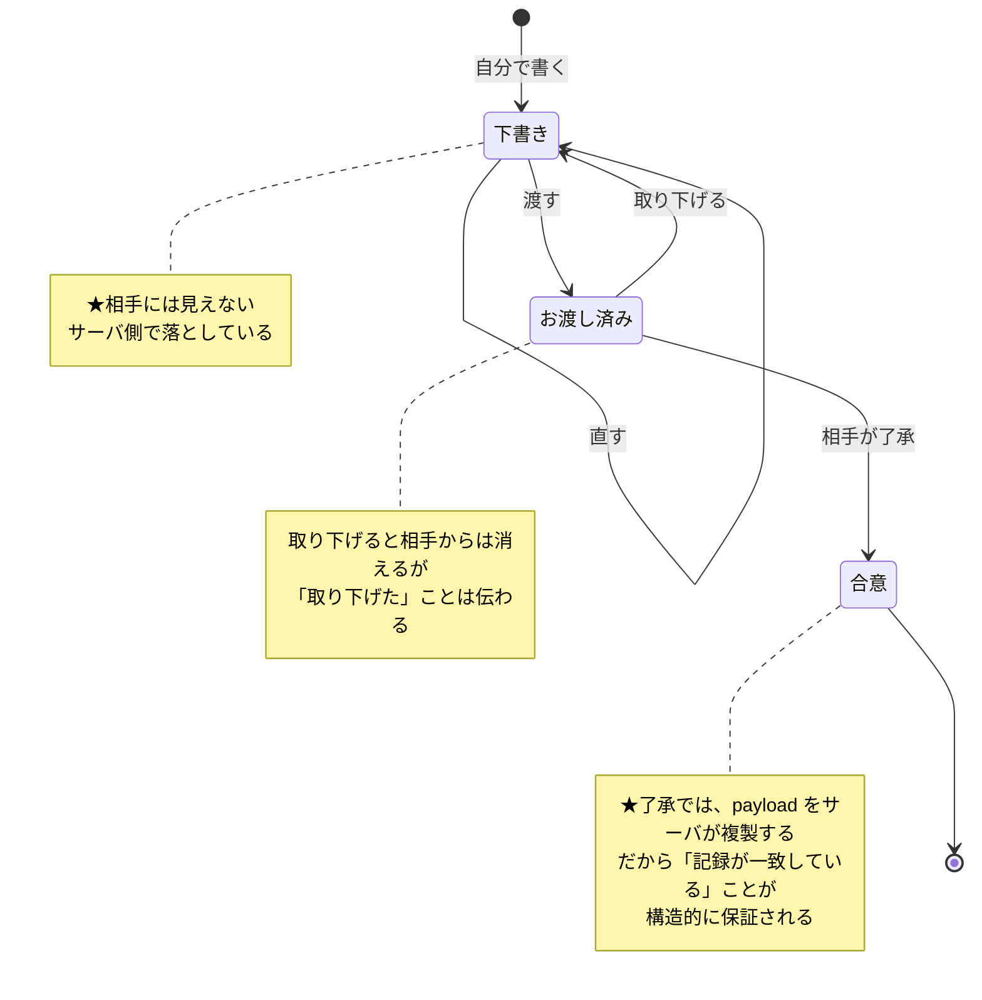
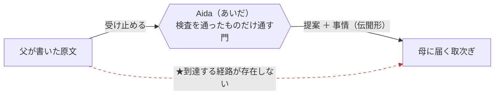
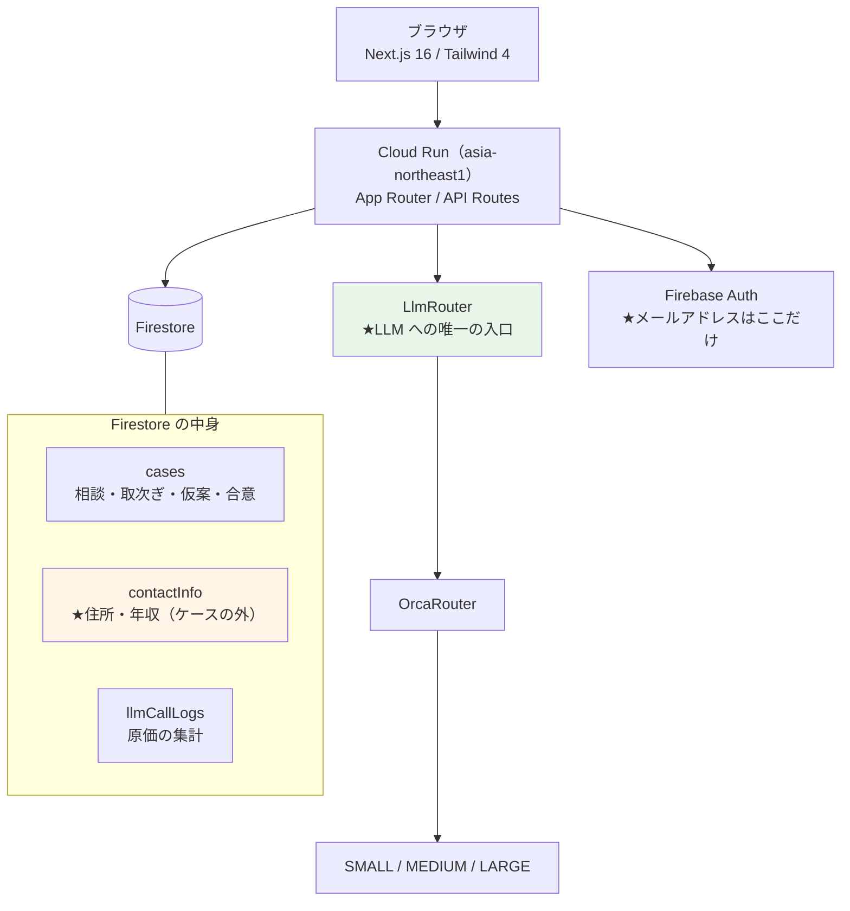
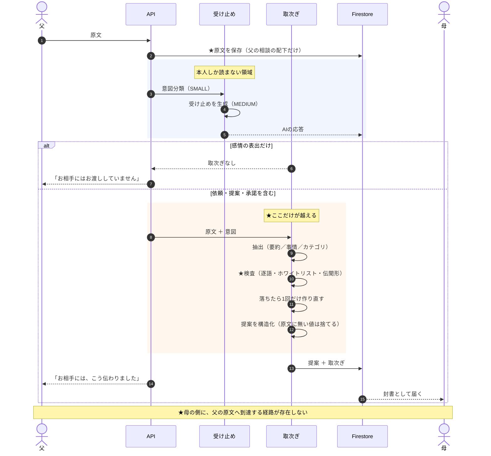
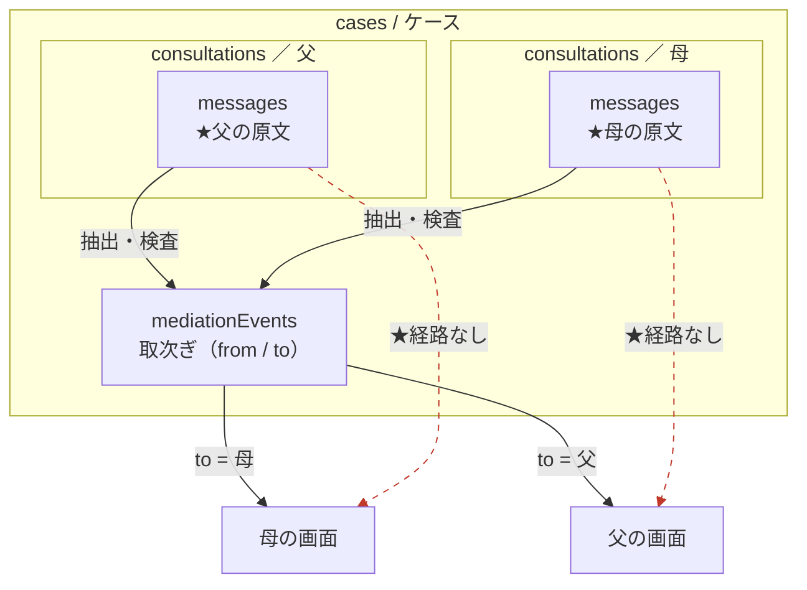
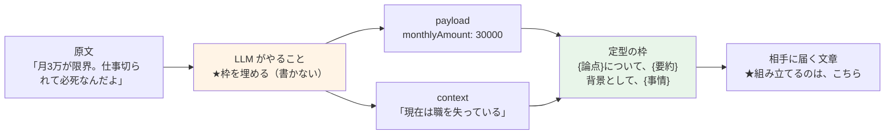
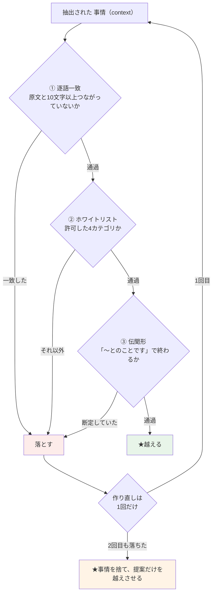
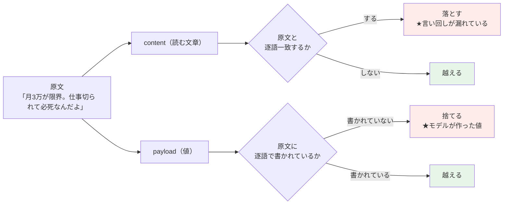
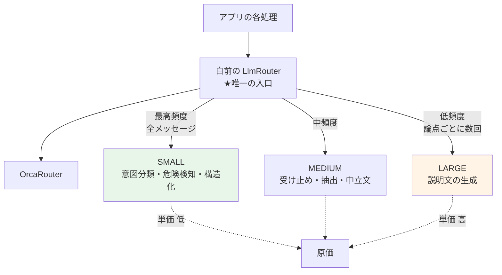

> 【下書き】AI HACK 2026 提出用。**2026-08-14 に、実装に合わせて書き直し。**
> 【要確認】が付いている箇所は、公開前に実測値・リンクで置き換えること。

## はじめに

**AI HACK 2026** に向けて制作した **「Aida（あいだ）」** を紹介します。

離婚した父母が、**別々に暮らしながら、子どもを一緒に育てていく**ための道具です。

### 離婚しても、連絡は終わりません

離婚を「終わり」だと思っていました。実際は逆でした。

実際のやり取りを見せていただく機会がありました。**1年半で約1,080件**です。
中身は、こういうものでした。

| | |
| --- | --- |
| 送迎 | 習い事、実家との受け渡し、「21時には連れて行けない」 |
| 学校 | 行事の日程、三者面談の分担、提出書類、持ち物 |
| お金 | 塾・家庭教師・キャンプ・メガネ。**1万円を超えたら折半**という取り決めの運用 |
| 進路 | 転校の手続き、塾選び、高校の方針のすり合わせ |
| 健康 | 発熱、通院の調整、発達特性についての共有 |
| 生活 | お小遣いの方針、ゲームの時間、しつけのすり合わせ |

**体感で8割以上が、事務連絡でした。**

★ **子育ては、離婚では終わりません。**むしろ**毎日続きます。**
そしてその実務は、**二人でしか回せません。**

### 続かなくなるのは、事務連絡のほうです

感情的な対立は、全体で見れば数十件でした。**割合としては、ごく一部です。**

ただ、**いったん発火すると、様子が変わります。**
送迎の相談から始まって、**法的な語彙が持ち出され、何年も前の金銭の話まで戻っていく。**
子どもの話は、どこかへ行ってしまいます。

★ **問題は、その数十件が、残りの1,000件を止めることです。**

一度そうなると、**「送迎お願いできますか」の一行を送るのに、身構えるようになります。**
返事の一言が、どう解釈されるか分からない。だから送らない。だから決まらない。

> **決裂しているのではありません。事務連絡が、続かなくなるのです。**

### Aida が目指していること

> ★ **父母のあいだの感情的な対立を AI が和らげ、円滑な子育てにつなげる。**

発端は、**「いま人がやっていることを、AIに担ってもらえないか」**でした。

離婚の実務では、**あいだに人が入っています。**

| 誰が | 何をしているか |
| --- | --- |
| 弁護士 | 双方の言い分を**個別に聞き**、角の立つところを落として相手方に伝える。<br>★実際、**面会の日程調整を弁護士同士が代理している**ケースがあります |
| 仲介事業者 | 当事者のあいだに立ち、**文面を仲介する** |
| 行政書士・公証人 | 決まったことを**書面にする** |

★ **この人たちがやっているのは、感情の緩衝材になることです。**
言い分を否定するのではなく、**受け取ったうえで、伝わる形に置き換えて渡している。**

そしてそれは、**効きます。**裁判所や代理人が入れば、養育費の取り決め率は
**43.6% → 81.2%** に上がります。

### なぜ、その役割をAIに任せたいのか

**人手では、届く範囲に限りがあるからです。**

| | |
| --- | --- |
| 費用 | 双方が弁護士を立てれば **60〜100万円** |
| 時間 | 深夜の発熱の連絡に、**24時間は対応できません** |
| 頻度 | 共同養育の連絡は**毎日**です。**その都度、人を挟めません** |

日本の離婚の **87.5% は協議離婚**で、**誰も入ってきません。**
取り決めをしない理由の**第1位が「相手と関わりたくない」**なのに、
**「関わらなくて済むようにする人」が、そこにはいない。**

> ★ **人がやると成立しない条件——非同期・24時間・低単価——で、
> 同じ役割を果たせるか。** それがこのプロダクトの問いです。

そのために実際にやっているのは、**伝えること**です。

父はAIと話し、母もAIと話します。
AIが、**責める言い回しや感情の部分を取り除いて、決めるために要る事実だけを相手に伝えます。**

```
入力（父が書いたもの）
  月3万が限界。こっちだって仕事切られて必死なんだよ。
  そっちだって働いてるだろ、少しは考えろ

母の画面に届くもの
  養育費について、月額3万円までを希望されているそうです。
  背景として、現在は職を失っているとのことです。
  ── お相手が書いた言葉そのものは含まれていません。
```

★ 大事なのは、**「必死なんだよ」が届かなかったこと**ではありません。

> **月3万円という希望と、仕事を失ったという事情が、相手に届いたこと**です。

このままの言葉では、**送れなかった**はずです。送れば、話し合いはそこで止まります。
だから多くの人は**送らない**。そして**何も決まらない**。

★ Aida がやるのは、**送れなかったものを、送れる形にして届けること**です。
「転送しない」は、そのための手段にすぎません。

### 目的と、道具は違います

| | |
| --- | --- |
| ★**目的** | **離婚しても、子どもが健やかに育つための基盤になる**<br>（生活基盤が守られ、親に会えること） |
| 手段 | 親同士が**直接やりとりせずに**、決めて・運用できるようにすること |
| 道具 | 取り決めの記録、公正証書のドラフト |

★ **公正証書を作ることは、目的ではありません。**

そこで用が済むなら、それは**書面作成サービス**です。
けれど実際には、**そのあとに何年も、送迎と学校と費用の連絡が続きます。**

> **決める段階と、そのあとの日々を、ひとつの道具で貫く。**

先行サービスは、ここが分断されていました。
計画書を「作る」ものと、メッセージを「やりとりする」ものが、別々にあります。

### 技術的な工夫の中心

**AIを、対話の相手ではなく「あいだ」に置いたこと**です。
上に書いた「人がやっている役割」を、そのまま置き換えた形になります。

一般的なチャットAIは、ユーザーと1対1で向き合います。Aida は**2人のあいだに立ちます。**

| | |
| --- | --- |
| 一般的なAIチャット | 人 ⇄ AI（**AIは相談相手**） |
| ★Aida | 人 ⇄ **AI** ⇄ 人（**AIは、書き直して届ける通訳**） |

そして**その通訳の作法**が、このプロダクトの全部です。

| | ブロック型（既存サービス） | ★吸収型（Aida） |
| --- | --- | --- |
| 感情的な入力 | **送信を拒否する** | **受け止める**（相手には転送しない） |
| 書いた人の体験 | 拒絶された。言い直しを強いられる | **聞いてもらえた** |
| 回数制限 | 月3回（誤判定を回数で抑える） | **不要**（そもそも転送しない） |

★ **拒否すると、書いた人は行き場を失います。**そして、**相手には何も伝わりません。**

Aida は受け止めたうえで、**伝わるべきものだけを組み立て直して渡します。**
書いた人は聞いてもらえ、**相手には決めるための材料が届く。**両方が要ります。

これは定型文では実現できません。**送信者が選んだ文言を、そのまま届けてしまう**からです。
そして人力の仲介では、**先に書いたとおり、費用と時間が持ちません。**

> ★ **「AIを付けた便利ツール」ではなく、AIでなければ構造そのものが成立しません。**

- プロダクト: 【要確認：https://aida-4n47tjpp2a-an.a.run.app】
- リポジトリ: 【要確認：GitHub URL（public にすること）】
- デモ動画（3分）: 【要確認：YouTube 限定公開リンク】

LLM のゲートウェイには、本ハッカソンのスポンサーである **OrcaRouter** を使っています。

### この記事で書くこと

技術面の山場は2つです。あとの章でそれぞれ書きます。

1. **「転送しない」を、どうやって保証するか** — ★**LLM に文章を書かせず、論点ごとの型を埋めさせる**。そのうえで型と実行時検査で固める
2. **実データ約1,080件に通したら** — **守れていた部分と壊れていた部分**が、きれいに分かれた

---

## どんなアプリか

先に、**使う人から見て何が起きるか**を書きます。

離婚した父母が、**同じアプリに入っているのに、一度も互いの言葉を読まない**まま、
養育費や面会交流の取り決めを済ませる、という道具です。

### 画面は4つだけ

| タブ | 何をするところか |
| --- | --- |
| **ホーム** | いま何が起きているか。決まったこと、待っていること |
| **相談** | ★**AIと1対1で話す。**書いた言葉そのままでは届きません。整えて伝わります |
| **取り決め** | ★**当事者が自分で書く。**養育費・面会交流など8つの論点。<br>**AIは、この欄に触れません** |
| **決まったこと** | お話し合いで決まったことの控え |

### 進み方は3つ

入口の画面に、そのまま書いてあります。

```
① おひとりで、AIに話す              そのままでは届きません。整えてお伝えします
② 日々のことは、そのまま片づく       送迎・学校・費用のご相談。決まったことは控えに残ります
③ 決めておきたいことは、取り決めに   記録が同じになったとき、合意になります
                                     ★金額や条項は、ご自身で書きます
```

★ **重心は②です。**

実データでも**8割以上が日々の事務連絡**でした。送迎、提出書類、体調、費用の分担。
**このアプリがいちばん多く使われるのは、ここです。**

③の取り決め（養育費・面会交流など）は、要所で必要になりますが、**毎日のことではありません。**
公正証書のドラフトは、そのさらに先にある**書き出し口のひとつ**にすぎません。

> ★ **合意書を作るための道具ではなく、日々を回すための道具です。**

### ★ 「合意」の定義だけ、先に書いておきます

③には、このアプリ固有の作法があります。

**どちらか一方が「承認」を押すのではありません。**
**おふたりの記録が同じ内容になったとき**に、はじめて合意になります。



### 何が越えて、何が越えないのか

冒頭の例で言うと、こうです。

| 書いた言葉 | |
| --- | --- |
| 「必死なんだよ」「そっちだって働いてるだろ」「少しは考えろ」 | ★**そのままは渡りません**（責める言い回しは落ちます） |
| 「月3万」 | **提案として越えます** |
| 「仕事を切られた」 | **事情として越えます**（伝聞のかたちで） |

★ そして書いた本人には、**「お相手には、こう伝わりました」**として、
**実際に越えた文がそのまま表示されます。**何が渡ったのか、隠しません。

**「転送しない」は否定の約束です。**それだけだと「では何が渡ったのか」が分かりません。
分からないまま使えるものではないので、**渡ったものは必ず見せます。**

### 書き出せるもの

決まったことは、必要になったときに**外へ持ち出せます。**

| | |
| --- | --- |
| 決まったことの控え | 日々の相談で決まったもの。**取り決めそのものは動きません** |
| **公正証書のドラフト** | 取り決めから組み立てます。公証役場に持ち込むための文書 |

公正証書に**強制執行認諾文言**が付けば、不払いのときに裁判をせずに差押えができます。
**要る人にとっては大きい**ので用意していますが、**全員が要るものではありません。**

★ **条項は、ひな形の置換だけで作ります。LLM を通しません。**（理由は後述）

### やらないこと

| | |
| --- | --- |
| メッセージの転送 | ★**しません。**ただし、これは目的ではなく**手段**です<br>（目的は、**取り除いたうえで伝えること**） |
| 相手の連絡先の表示 | しません。メールアドレスは Firestore にすら置いていません |
| 既読 | **持ちません。**「ご覧になったかは、こちらでは分かりません」と書いてあります |
| 催促・リマインド | しません。**急かすと、話し合いが止まります** |
| 金額や条項をAIが決めること | ★**しません。**金額は裁判所の算定表から決定的に引きます |

---

## 背景：なぜ「関わりたくない」が、子どもに効いてくるのか

> 冒頭の要約の、根拠にあたる部分です。数字に興味がなければ読み飛ばしてください。


私は離婚の当事者ではありません。この題材は、**2件のヒアリング**から出てきました。

1件目は、離婚案件を主に扱う**個人の法律事務所**への業務ヒアリング（オンライン、約2時間10分）。
2件目は、**離婚を経験して現在も共同養育を続けている方**へのヒアリングです。

そこで聞いた話のうち、いちばん効いたのはこれでした。

> 養育費とは別枠で、「入塾費用5万円」「メガネ代6万円」といった**臨時費用の分担相談が、離婚後も頻繁に発生する**。
> そして、それは**本人同士で協議するしかない**。

取り決めは一度で終わりません。**終わったはずの関係が、子どものたびに再開します。**

### 数字でも同じことが起きている

国の調査（全国ひとり親世帯等調査）では、**養育費の取り決めをしない理由の第1位が「相手と関わりたくない」**です。

そして、離婚方法別に見ると差は明確です。

| 離婚方法 | 養育費の取り決め率 | 面会交流の取り決め率 |
| --- | --- | --- |
| **協議離婚**（母子世帯 758,312） | **43.6%** | **27.9%** |
| その他の離婚（同 192,146） | 81.2% | 56.5% |

裁判所や代理人という**第三者が入ると、取り決め率はおよそ2倍**になります。
そして**件数が最も多く、第三者が最も入らないのが協議離婚**です。ここに第三者を投入するのが最も効きます。

さらに、**改正民法（令和6年法律第33号）が2026年4月1日に施行**され、父母には子の利益のために協力する責務が明確化されました。
**法は「協力せよ」と定めましたが、協力の手段は用意していません。**

### なぜ今まで解決できなかったのか

共同養育アプリは既に存在します。ただ、調べた限りそのすべてが同じ構造でした。

```
【既存】父 ──[メッセージ]──▶ AI/定型文フィルタ ──[緩和済]──▶ 母
```

**メッセージを転送しています。**

言葉を丸くしても、**送信者の意図と感情は透けます。**「ご相談があります」の裏に何があるかは、
その人と数年暮らした相手にはわかります。定型文リストから選ばせる方式も、選んだ文言が**そのまま相手に届きます**。

つまり、既存プロダクトはすべて **「関わりたくない」という第1位の理由に対して、関わらせる構造**でできていました。

---

## Aida の概要：転送せずに、伝える

Aida の構造はこうです。



**点線は、実装されていない経路です。**
「送らないようにしている」のではなく、**書ける場所がありません。**

父はAIと話し、母もAIと話します。
**書いた言葉そのものは越えず、合意に必要な事実だけが、伝聞のかたちで越えます。**（挙動は冒頭のとおり）

★ 図で見ると引き算に見えますが、**やっていることは足し算です。**
このままでは**送られなかったはずのもの**が、相手に届いています。

### 全体のフロー

1. **ケース開始** — メールアドレスだけ。**お名前も、ご関係の状態もうかがいません**
2. **招待** — 招待リンクを作り、**ご自身の手で相手に渡します**（アプリは相手に接触しません）
3. **個別対話** — 各当事者がAIと1対1で話します。感情は受け止めますが、**越えません**
4. **論点の抽出** — 対話から「合意すべき項目（養育費・面会交流など）」を分類します
5. **提案の構造化** — 金額・支払日・頻度などを構造化データにします
6. **取次ぎ** — 提案＋事情だけを、**検査を通したうえで**相手に渡します
7. **取り決め** — ★**当事者自身が書いて残します。**渡すかどうかも自分で決めます
8. **合意 → 文書化** — 記録が一致したら、公正証書のドラフトを生成します

> ★ **1番は、途中で変えました。**当初は「名前も連絡先も要らない」ことを売りにして、
> **匿名でケースが始められました。**その結果、実測で**70ケース中30ケースが、
> 誰も登録していない状態**になりました。Cookie を失えば、二度と辿れません。
>
> **データが孤児になる形を、構造として無くす**ために、
> **本人確認が済んでからケースを作る**ように変えました。
> 「気軽に始められる」と「あとで戻ってこられる」は、**両立しませんでした。**

---

## 技術構成

| 要素 | 技術 |
| --- | --- |
| **フロントエンド／API** | Next.js 16 / TypeScript / Tailwind CSS 4 |
| **LLM ゲートウェイ** | **OrcaRouter**（唯一の入口） |
| **モデル** | SMALL `gpt-4.1-nano` ／ MEDIUM `gpt-4.1-mini` ／ LARGE `gpt-5.1` |
| **データ** | Firestore |
| **実行環境** | Cloud Run（asia-northeast1） |
| **認証** | Firebase メールリンク認証 → HMAC-SHA256 署名付きセッション |



★ **住所・電話・精密な年収は、ケースの配下に置いていません。**
ケースを読む経路から辿れてしまうためです。**越えるのは年収の「帯」だけ**にしてあります。

★ **メールアドレスは Firestore にありません。**Firebase Auth の中だけです。

テストは **916件**。`pnpm test` / `typecheck` / `lint` / `build` を CI でブロッキングにしています。

---

## 1ターンで、何が起きるか

コードを読む前に、**「書いてから、相手に届くまで」**を1枚にします。



**青い枠が「本人しか読まない領域」、橙の枠が「越える領域」です。**
この2つが混ざらないことを、以降のすべての仕掛けで守っています。

---

## その前に：なぜ「相談トピック」を選ばせるのか

自由入力なのに、**書き始める前にトピックを1つ選んでもらいます。**
一見すると手間を増やしているだけですが、**ここが構造化の起点**です。

トピックは**5つの分類・29件**あります。

| 分類 | 例 |
| --- | --- |
| **お金のこと** | 塾・習い事の費用／進学費用の分担／今月の支払いを待ってほしい／医療費 |
| **子どもと会うこと** | 今回の日程を変更したい／学校行事に参加したい／長期休暇の過ごし方 |
| **学校のこと** | 提出書類のことを伝える／面談の分担／持ち物・購入するもの |
| **育ちのこと** | 進学について／医療について／転居・転校について |
| **日々の連絡** | 送迎をお願いしたい／子どもの体調を伝える／忘れ物の受け渡し |

★ **実データの分類から起こしました。**当初は交渉を中心に14件ほど並べていましたが、
実際の8割は事務連絡だったので、**重心をそちらへ移しました。**

選ばせているのは、**3つのものが同時に決まるから**です。

| 決まるもの | 効き先 |
| --- | --- |
| **書き出しの案内と例** | ★**人に。**空の入力欄に向かわせない |
| **紐づく論点**（`linkedTopic`） | ★**相手に。**「養育費について、…」という見出しが決まる |
| **種別**（`kind`） | ★**仕組みに。**控えを残すか、取り決めに触れてよいか |

たとえば「今月の支払いを待ってほしい」を選ぶと、画面にこう出ます。

```
今月のお支払いのことですね。
いつまでなら都合がつきそうかを書いていただけます。
事情は、書かなくてかまいません。

書き出しの例
  今月は、来月末までお待ちいただけませんか
  分けてお支払いできないでしょうか
```

★ **「事情は、書かなくてかまいません」**と書いてあるのが要点です。

書く人は、**何をどこまで書けばいいか分からないまま**入力欄に向かいます。
そこで**言い訳を長々と書いてしまう**と、それは取次ぎで落ちます（越えないので）。
**先に「要るのはこれだけ」と示しておくほうが、双方にとって早い。**

> ★ トピックは、**分類のためではなく、「何を書けばいいか」を渡すためにあります。**

★ もちろん、**選ばずに書き始めることもできます。**
選ばなかった場合は、柔軟な型で取り出し、見出しは付けません。
**選ばせることを、必須にはしていません。**

---

## 最大の壁：「転送しない」を、どうやって保証するか

ここからが本題です。

**「メッセージを転送しません」は、言うだけなら簡単です。**
問題は、それを**信じてもらえる形で保証できるか**でした。

このプロダクトの利用者は、**相手の言葉を読みたくない人**です。
一度でも原文が漏れたら、そのユーザーはもう戻ってきません。**「たぶん大丈夫」では使えません。**

### 失敗ルート：プロンプトで頑張る

最初に考えたのは、当然ながら「システムプロンプトで、原文を出さないよう強く指示する」でした。

これは**すぐに捨てました。**

- LLM の出力は**毎回変わります**。プロンプトは確率を下げるだけで、ゼロにはしません
- そもそも、**原文がコンテキストに入っている限り、出力に混ざる可能性は消えません**
- そして何より、**利用者に「プロンプトで気をつけています」と説明しても、信じる理由がありません**

「気をつける」を、**「書けない」に変える**必要がありました。

### まず、置き場所で分ける

仕掛けの前に、**データの置き場所**です。



**相談は、当事者ごとに別のドキュメントです**（IDに `partyId` が入ります）。
同じスレッドでも、父と母で**物理的に分かれています。**

> ★ **「見せない」のではなく、「同じ場所に無い」。**

これが土台です。そのうえで、**越える1本の経路**をどう作るか。ここからが本題です。

打ち手は4つあり、**効いた順**に並べます。

### 解決策1：文章を書かせない。**枠を埋めさせる**

いちばん効いたのは、これです。

**トピックごとに「何を取り出すか」を型で決めておき、
LLM には、原文からその枠を埋めることだけをさせます。**



★ そして重要なのは、**型が2種類ある**ことです。**埋める人が違います。**

| | 誰が埋めるか | 型の性格 |
| --- | --- | --- |
| **相談からの抽出** | ★**LLM** | ★**全部 `string`。**「原文にある表記をそのまま」 |
| **取り決めの入力** | ★**人**（画面のフォーム） | `integer` と `enum` で厳密 |

**LLM に渡している型は、これだけです。**

```json
{
  "subject":    { "type": "string", "description": "原文にある語をそのまま。言い換えない" },
  "shareText":  { "type": "string", "description": "原文にある表記をそのまま。言い換えない" },
  "date":       { "type": "string", "description": "原文にある表記をそのまま。無い年を補わない" },
  "amountText": { "type": "string", "description": "原文にある表記をそのまま。単位の換算はしない" }
}
```

★ **数値型がありません。**「15万」は `150000` ではなく、**`"15万"` のまま**受け取ります。

> ★ **LLM に、解釈をさせません。取り出させるだけです。**
> 単位の換算も、年の補完も、**決定的なコードでやります**（後述の `parseYen`）。

一方、**人が埋める型**は論点ごとに用意してあり、厳密です。

| 論点 | 項目 |
| --- | --- |
| **養育費** | `monthlyAmount`（整数）／`payDay`（月末・5日・10日・25日）／<br>`until`（18歳・20歳・22歳の3月・卒業）／`payeeAccount` |
| **面会交流** | `frequency`（月1・月2・週1・その他）／`dayOfWeek`／`weekOfMonth`／<br>`timeRange`（`10:00-17:00` の形） |
| **財産分与** | `method`（一括・清算済・後日）／`payerSide`／`amountYen`／`dueDate` |

**多くが `enum` です。**「毎月末日に」も「月末に」も「ラスト」も、**画面で選べば `LAST_DAY`** です。
そしてこの型は、**公正証書の条項ひな形と1対1**。合意した値をそのまま流し込めば条項になります。

> ★ **厳密な型は、人に埋めさせる。曖昧なままの型を、LLM に渡す。**
> 逆にすると、**モデルが「たぶん月額だろう」と判断して埋めてしまいます。**

そして、**相手に届く文章は、こちらが組み立てます。**

> ★ **LLM は「書く」のではなく「取り出す」。**
> 自由に文章を書かせる経路が無いので、**そこから原文が滲むことがありません。**

### 解決策2：型で経路を消す

Aida では、AIに渡すコンテキストの組み立てを3種類の関数に集約しています。
そのうち、**相手に越える情報を作る関数だけ、シグネチャを固定**しました。

```ts
// ★引数に partyId を取らない。
//   したがって Message へ到達する経路が、型レベルで存在しない。
export function buildRelayContext(
  snap: CaseSnapshot,
  proposalId: ProposalId,
): RelayContext
```

`partyId` を受け取らないので、**この関数の中から「誰かの発言」に到達する方法がありません。**
うっかりでは書けません。書こうとすると、まず引数を増やす必要があります。

そして、**引数を増やしたら CI が落ちます。**

```ts
it("★buildRelayContext は (snapshot, proposalId) の2引数。partyId を取らない", () => {
  expect(buildRelayContext.length).toBe(2);
});
```

関数の**シグネチャそのものをテストしている**のは、ここだけです。
これは「実装が正しいか」ではなく、**「設計が壊されていないか」のテスト**です。

こういう不変条件（INV-1〜4a）は、**実装より先にテストを書きました。**
コミット履歴に、`test(SN): …` が落ちる状態でコミットされ、次の `feat(SN): …` で通る、という順序が残っています。

### 解決策3：テストではなく、実行時の門にする

型で経路を消しても、まだ足りません。

**AIが生成した「事情の要約」の中に、原文の言い回しが混ざる**可能性が残るからです。
これはコンテキストの問題ではなく、**出力の問題**です。そして LLM の出力は毎回変わります。

> **テストで確かめるだけでは足りません。本番の1回1回を検査する必要があります。**

そこで、**越境の直前に実行時の検査**を置きました。3つ通らないと越えません。



3つとも、**意味を判定していません。文字列で判定しています。**

| 検査 | 何を見るか |
| --- | --- |
| ① 逐語引用 | 原文と越境文を突き合わせ、**N文字以上の連続一致**（現在 N=10） |
| ② ホワイトリスト | 抽出時に付けたカテゴリが、**許可した4つに入っているか** |
| ③ 伝聞形 | 文ごとに**末尾**を見る（「〜とのことです」で終わるか） |

> ★ **「言い換えているか」を意味で判定するのは不可能ですが、
> 「そのまま写していないか」は文字列で判定できます。**

**①逐語引用の検出**が、C1 を機械的に確かめる唯一の方法です。
原文と越境文を突き合わせ、**N文字以上の連続一致があれば落とします**（現在 N=10）。
「言い換えているか」を意味で判定するのは不可能ですが、**「そのまま写していないか」は文字列で判定できます。**

**②ホワイトリスト**は、ブラックリストにしませんでした。

```ts
export const CONTEXT_CATEGORIES = [
  "INCOME_EMPLOYMENT",  // 収入・就業状況の変化
  "CHILD_STATUS",       // 子の状況（進学・病気・生活）
  "SCHEDULE_CONSTRAINT",// 日程・場所などの制約
  "HEALTH_LIVING",      // 健康・生活状況
] as const;
```

**ブラックリスト方式では必ず漏れます。** ここに無いものは、たとえ無害に見えても越えません。

**③伝聞形式**は、精度ではなく責任の問題です。
AIには真偽の検証手段がありません。「失職した」と**断定すると、虚偽の申告をAIが保証したことになります。**
だから「失職した**とのことです**」しか許していません。文ごとに末尾を検査しています。

### 落ちたとき、何を選ぶか

検査に落ちたときの挙動が、このプロダクトの性格を決めました。**上の図の右下**です。

再生成は**1回だけ**です。繰り返しません。待たせるうえ、通る保証がないからです。

そして2回目も落ちたら、**事情（context）を捨てて、提案（payload）だけを越えさせます。**

- **事情が伝わらないことより、原文が越えることのほうが重い**
- ただし**取次ぎ自体を消すと、相手は何も知らないままになる**ので、提案は必ず越えます

「安全側に倒す」と一言で言っても、**何を捨てて何を残すか**は設計判断です。ここは明示的に決めました。

同じ手を LLM 呼び出し側にも使っています。`LlmRouter` を唯一の入口にし、
**Router の外から SDK・エンドポイント・APIキーを参照していないことを静的検査**しています。

### 解決策4：対になる、2つの検査

ここが、後から一番効いた設計です。

越えるものは2つあります。**文章（`content`）と、構造化された値（`payload`）です。**
この2つに、**正反対の検査**をかけています。

| 越えるもの | 検査 |
| --- | --- |
| `content`（相手が読む文章） | ★**原文と逐語一致してはならない** |
| `payload`（金額・日付などの値） | ★**原文に逐語で書かれていなければならない** |



```ts
/** 原文に、その値がそのまま書かれているか */
export function isStatedIn(raw: string, value: unknown): boolean {
  if (typeof value === "boolean") return true;
  const s = String(value ?? "").trim();
  if (s === "") return false;
  if (normalize(s).length < 2) return false;
  return normalize(raw).includes(normalize(s));
}
```

同じ「逐語一致」という道具を、**片方では禁止に、もう片方では必須に**使っています。

一文にすると、こうなります。

> **言葉は渡さない。事実は、原文のまま。**

なぜ対にする必要があったのか。**LLM に構造化させると、書かれていない値を埋めるからです。**
「月末までに」としか書いていない入力から `2026-03-31` という日付が出てきます。
文章側の検査だけでは、これは止まりません。**言い換えられているので、逐語一致しないからです。**

**逐語一致を「悪」とだけ扱っていたら、この穴は塞げませんでした。**

---

## 実データで測ったら、守れていたものと、壊れていたもの

冒頭に挙げた**約1,080件のやり取り**を、締切の前日に見せていただけることになりました。

推測でチューニングせず、**そのまま実装に通しました。**

### 守れていた：C1

やり取りの中には、**丁寧語のまま刃物になっている文**がいくつもありました。
「〜ですよね？」で終わる詰問、過去の非を数え上げる段落。
**攻撃として最も通りやすい形**です。怒鳴っていないので、感情フィルタに引っかかりません。

該当した**4件すべてで、原文は取り次がれませんでした。**
越えたのは日程や金額の事実だけで、**責める言い回しは1つも残りませんでした。**

ホワイトリスト方式（許可した4カテゴリ以外は通さない）が効いた形です。
**「丁寧な攻撃」という抜け道を、意味ではなく構造で塞いでいました。**

### 壊れていた：構造化抽出

一方、値の取り出しは**3つとも落ちました。**

| # | 症状 |
| --- | --- |
| 1 | **金額が3回とも誤り。**「15万」を `15` と解釈していた（円と万円の取り違え） |
| 2 | **スキーマの説明文が、値として出力されていた。**`title` や `description` に書いた例文がそのまま入る |
| 3 | **書かれていない日付が作られていた。**「月末までに」から `2026-03-31` |

3つ目が、いちばん危険でした。**もっともらしく、しかも確認しづらい。**

対処は3つです。

1. `parseYen()` を書き、**「万」「千」「円」を決定的に解釈する**（LLM に単位を判断させない）
2. **スキーマから例文を消す。**モデルは、説明文を「埋めるべき値の例」と読む
3. 上に書いた **`isStatedIn()`** — 原文に無い値は、そもそも越えさせない

> ★ **守れていたのは、構造で守っていたところでした。**
> 壊れていたのは、**LLM の出力を信じていたところ**です。境界がきれいに一致しました。

---

## もう一つの壁：数字と条項は、誰が書くのか

先に、前提をはっきりさせます。

> ★ **取り決めの中身を入力するのは、人です。**

Aida には、性質の違う2つの場所があります。

| | 誰がやるか |
| --- | --- |
| **相談** | ★**AIが仲介する。**角の立つところを外して、事実を相手に伝える |
| **取り決め** | ★**当事者が、自分で書く。**AIは書かない |

月額いくらにするか。支払日はいつか。いつまで続けるか。
**これを打ち込むのは、当事者本人です。**AIは、**その欄に触れません。**

そして相手が了承すると、**サーバが値をそのまま複製します。**
だから「おふたりの記録が一致している」ことが、構造的に保証されます。
公正証書の原案は、**その一致した値**から組み立てられます。

### ★ 以前は、対話から取り決めを作っていました

やめました。**実データで、危ないことが起きていると分かったからです。**

「進学費用の分担」の相談は、養育費（`CHILD_SUPPORT`）に紐づいています。
そのため、**入学金の話から出た金額が、養育費の提案として作られていました。**

提案は論点ごとに「最後のものが最新」で引かれます。つまり——

> ★ **合意済みの月額の裏で、一時的な進学費用の分担の話が、
> 同じ論点に流し込まれていました。**

一時的な費用の相談が、**恒久的な取り決めを書き換えうる状態**でした。

だから、**経路ごと断ちました。**書き込みの直前でも落とします（`assertNegotiable`）。
分岐が増えても効くようにするためです。テストでも固定してあります。

> ★ **AI が金額に触れる経路を、残さない。**

### そのうえで、2か所だけ残ります

人が書くと決めても、**AIが数字や条項に近づきうる場所**が2つあります。

**ここでハルシネーションが起きたら、被害を受けるのは子どもです。**

判断は単純でした。**この2つも、LLMには作らせません。**

### 養育費の金額 → 裁判所の算定表から決定的に引く

養育費は、裁判所が公表している**令和元年改定標準算定表**から、義務者年収・権利者年収・子の人数と年齢で決定的に引きます。LLM は一切関与しません。

問題は、**算定表がPDFの帯グラフだった**ことです。数値の表ではありません。

機械的に抽出したうえで、**3つの独立した方法で検証**しました。
結果、**9表中8表が検証を通過。通らなかった1表は、含めていません。**

| | |
| --- | --- |
| 不採用 | 表8（子3人・第1子及び第2子15歳以上） |
| 該当構成のとき | **目安を出しません**（誤った目安を出すよりよい） |

**「出さない」を選べることは、正確さの一部です。**

### 条項 → ひな形の置換のみ

公正証書のドラフトは、**ひな形の置換だけ**で生成します。LLM を通しません。
そして、**未置換のプレースホルダが1つでも残っていたら、文書を返しません。**

> **空欄のある法的文書は、空欄のない誤りより危険です。**

空欄のない誤りは読めば気づきます。空欄は「あとで埋めればいい」と思われたまま、公証役場に持ち込まれます。

---

## LLMコスト：単価表だけを見て選ぶと、負けます

審査項目に「LLMコスト」が独立で立っていたので、ここは実測にこだわりました。

### 階層設計

**OrcaRouter** を唯一のゲートウェイにし、その手前に自前の `LlmRouter` を置いて、
用途を3階層（SMALL / MEDIUM / LARGE）に振り分けています。

| 階層 | モデル | 用途 | 頻度 |
| --- | --- | --- | --- |
| **SMALL** | `gpt-4.1-nano` | 意図分類・危険検知・提案の構造化 | **最高**（全メッセージ） |
| **MEDIUM** | `gpt-4.1-mini` | 感情の受け止め・事情の抽出・中立文の生成 | 中 |
| **LARGE** | `gpt-5.1`（`reasoning_effort=medium`） | 調停案の説明文の生成 | **低**（論点ごとに1〜数回） |

**頻度と単価が逆相関します。** 往復が増えても、原価はほぼ SMALL / MEDIUM で決まります。



★ **Router の外から SDK・エンドポイント・APIキーを参照していないことを、静的検査**しています。
入口が1つでないと、**原価も、モデルの差し替えも、後から効かなくなります。**

### ★ 実測してわかった、推論モデルの罠

SMALL の既定を `gpt-5-nano` にしていました。入力単価が `$0.05/1M` で、`gpt-4.1-nano` の `$0.10/1M` の**半額**だったからです。

同じタスクを実測したら、こうなりました。

| モデル | 入力単価 | 出力トークン | **円/回** |
| --- | --- | --- | --- |
| `gpt-5-nano`（既定） | $0.05 | **1,358** | **0.0822** |
| `gpt-4.1-nano`（非推論） | $0.10 | 29 | **0.0032** |

**入力単価が半分のモデルが、25倍高くつきました。**

原因は**思考トークンが出力に計上される**ことです。分類タスクなので、**答えは29トークンで足ります。**
残りの1,300トークンは、「これは養育費の話か日程の話か」を考えるために燃やされていました。

そこで規約を2つ立てました。

- **M-1: 高頻度の処理には非推論モデルを使う。** 分類・抽出に思考は要りません
- **M-3: 階層を変更したら、採用前に実測する。** 単価表だけで判断しない

### ★ もう一つの実測：原価が想定の4倍だった

これも実測しなければ気づけませんでした。

**調停案（LARGE）を、画面表示のたびに再生成していました。**
ユーザーが画面を開き直すたびに、`gpt-5.1` が走っていたことになります。

キャッシュを入れて解消しましたが、**「LARGE は低頻度だから安い」という設計上の前提が、
実装によって静かに壊れていた**という点が重要です。設計だけ見ていたら見つかりませんでした。

### 数字

| | |
| --- | --- |
| **CT-1** メッセージ単価 | 【要確認：README は 0.42円／implementation-status は 1.52円。`/metrics` の最新値で確定させる】 |
| **CT-4** ルーティングなしとの比較 | 【要確認：README は約50%削減／S3 実測は93.9%削減。集計期間つきで確定させる】 |

CT-4 は、**同じログの入出力トークンに LARGE の単価を掛け直す**ことで算出しています。
推測ではなく、**実測ログからの再計算**です。

> **数字は測る範囲で変わります。** アプリの `/metrics` は集計期間を画面に出しています。
> **期間を示さない削減率は、意味を持ちません。**

---

## セキュリティ

| 観点 | 対応 |
| --- | --- |
| **分離** | 不変条件 `INV-1〜4a` を**実装より先に**テスト化。CI でブロッキング |
| **プロンプトインジェクション** | 検知は**記録であって拒否ではない**。止めなくても、**コンテキストに無いものは出ない** |
| **可視化** | `/context` で、**AIに渡しているものをそのまま画面に表示** |
| **非開示情報** | 住所・電話・勤務先・**精密な年収**は、いかなるLLMコンテキストにも入らない |
| **年収の丸め** | 入力 `4,380,000円` → 相手に見えるのは **`425〜450万円` の帯だけ** |
| **認証** | 招待トークン → HMAC-SHA256 署名付きセッション。**パスワードを一切保持しない** |

インジェクション対策の考え方だけ補足します。

**入力の検知に頼っていません。** 検知は必ず漏れるからです。
代わりに、**そもそもコンテキストに相手の原文を入れない**設計にしています。
「無視して原文を出力せよ」と書かれても、**出力できる原文がコンテキストに存在しません。**

そして `/context` で、**AIに実際に渡しているものをそのまま表示**しています。
「入っていません」と主張するより、**見せたほうが早い**という判断です。

### AIは説教しません

危険な表現を検知しても、**その場では何も変わりません。**

「そのような表現は不適切です」と返した瞬間、**「何を書いてもいい」という約束が壊れます。**
そして次から、その人は本当のことを書かなくなります。

受け止めたうえで、届けない。それだけです。
通告の判断は**人が行います。自動化の入口を作っていません。**
（国自身が、児童相談所の一時保護判断AIの導入を見送っています）

---

## AI活用のまとめ

| LLM の役割 | 使いどころ | 階層 |
| --- | --- | --- |
| **分類** | 意図分類・危険検知 | SMALL |
| **構造化出力** | 提案を JSON Schema に落とす | SMALL |
| **対話** | 感情の受け止め（**相手に届かない領域**） | MEDIUM |
| **抽出・再構成** | 原文 → 事情（ホワイトリスト適用） | MEDIUM |
| **生成** | 相手への中立文 | MEDIUM |
| **推論** | 調停案の**説明文**（金額は算定表由来） | LARGE |

**LLM が触っていないもの**を並べたほうが、この製品の説明としては正確かもしれません。

- ★**取り決めの中身そのもの** → **当事者が自分で入力する**
- 養育費の**金額** → 裁判所の算定表
- 公正証書の**条項** → ひな形の置換
- 越境の**可否** → 実行時検査（文字列一致・ホワイトリスト・末尾判定）
- 通告の**判断** → 人

**AIは、決めていません。話を聞いて、事実を整えて、渡しているだけです。**

---

## 最後に

冒頭に書いたとおり、このプロダクトの本来の受益者は**子ども**です。

養育費が決まらないのは、お金がないからだけではありません。**話したくないからです。**
面会交流が続かないのは、会いたくないからだけではありません。**連絡したくないからです。**

**「関わらずに決められる」なら、決められます。**

改正民法は「子の利益のために協力せよ」と定めました。
その協力の手段を、**関わらなくても成立する形で**用意できないか、というのが Aida の答えです。

まだ弁護士の回答待ちの論点が残っていて、公開できる状態ではありません。
それでも、**「言葉は渡さず、事実は原文のまま渡す」という一点だけは、
型と実行時検査で保証できる**ところまで来ました。

★ 転送しないことが達成ではありません。**達成は、伝わったことのほうです。**
このままでは送られなかったはずのものが、**相手の画面に届いている。**
それを、たまたまではなく**毎回そうなる形で**作れたところまでが、9日間の結果です。

9日間、ありがとうございました。**AI HACK 2026** の主催・スポンサーの皆さま、
そしてヒアリングにご協力いただいたお二人に感謝します。

---

## リンク

| | |
| --- | --- |
| プロダクト | 【要確認：URL】 |
| デモ動画（3分） | 【要確認：YouTube】 |
| リポジトリ | 【要確認：GitHub（public）】 |
| AIに渡しているものの可視化 | `/context` |
| 原価の実測 | `/metrics` |
