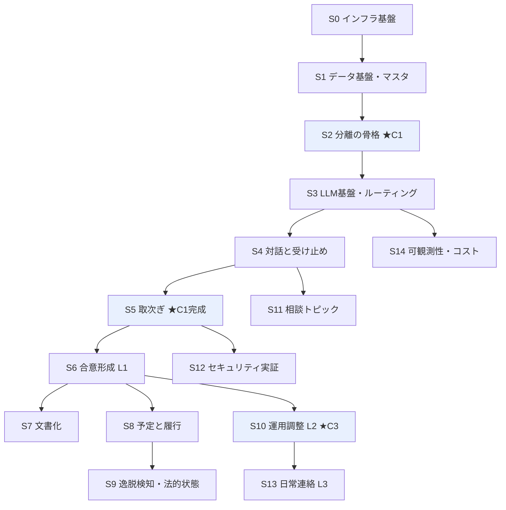

# 開発ロードマップ（機能スライス）— Aida（あいだ）

| 項目 | 内容 |
| --- | --- |
| 作成日 | 2026-08-11 |
| 位置づけ | 開発を機能単位のスライスに分割し、依存関係と順序を定義する |
| 前提 | [product-requirements.md](../docs/product-requirements.md) / [functional-design.md](../docs/functional-design.md) / [architecture.md](../docs/architecture.md) |
| 運用 | スライスに着手する際、`.steering/YYYYMMDD-sliceN-<名前>/` を作成し requirements / design / tasklist を起こす |

---

## 1. スライスの考え方

| # | 原則 |
| --- | --- |
| 1 | **各スライスは、完了時に「何ができるようになったか」を1文で言える** |
| 2 | **インフラもスライスとして扱う。**最後に回さない |
| 3 | **C1（メッセージが跨がらない）を、AIを載せる前に確立する** |
| 4 | 依存の逆流を作らない。前のスライスの成果物を壊さない |

---

## 2. 依存関係

---

## 3. スライス一覧

### S0｜インフラ基盤

> **完了時**：中身が空のアプリが、本番URL（Cloud Run）で動いている。

| 項目 | 内容 |
| --- | --- |
| 成果物 | GCPプロジェクト、Terraform（Cloud Run / Artifact Registry / Secret Manager / IAM）、Next.js雛形、Dockerfile、GitHub Actions（lint/typecheck）、Cloud Build |
| 完了条件 | `main` への push でデプロイされ、本番URLで表示される |
| 参照 | architecture.md §2.2.5 / §6 |

> **最初に置く理由**：インフラを最後に回すのが最も多い失敗要因である。パイプラインが通ってから中身を作る。

---

### S1｜データ基盤・マスタ

> **完了時**：データ構造が確定し、マスタが投入されている。

| 項目 | 内容 |
| --- | --- |
| 成果物 | Firestoreコレクション設計、`firestore.rules`（default deny）、マスタseed（TopicCategory / Scenario / PayloadSchema / ClauseTemplate）、`domain/agreement` の型と状態機械 |
| 完了条件 | Emulatorと本番の両方でseedが投入でき、状態遷移の単体テストが全パス網羅で通る |
| 参照 | functional-design.md §4 / architecture.md §3 |

---

### S2｜分離の骨格 ★C1

> **完了時**：2つのセッションが独立して存在し、**跨がないことがテストで証明されている**。

| 項目 | 内容 |
| --- | --- |
| 成果物 | 認証・招待コード、Case/Party/Consultation/Message、**ContextBuilder 3種**（`buildContext` / `buildRelayContext` / `buildMediationContext`）、**INV-1〜4のテスト**、Firestoreルールテスト |
| 完了条件 | **不変条件テストとルールテストがCIでブロッキングとして通っている** |
| 参照 | functional-design.md §4.10 / §5.2 |

> **このスライスが最重要。**AIを載せる前に「破れない」ことを確立する。後から制約を守らせるのは難しく、C1が破れたらプロダクトが成立しない。

---

### S3｜LLM基盤・ルーティング

> **完了時**：LLMが呼べて、コストが記録される。

| 項目 | 内容 |
| --- | --- |
| 成果物 | `LlmRouter`（唯一の入口）、階層設定（SMALL/MEDIUM/LARGE）、`LlmCallLog`、OrcaRouter接続、構造化出力の疎通確認 |
| 完了条件 | 呼び出しがすべてログに記録される。**Router を経由しない呼び出しが静的検査で検出される** |
| 参照 | architecture.md §4 |
| 前提 | ✅ 調査済（→ architecture.md §4.0）。**OpenAI互換・構造化出力対応・ゼロマークアップ** |

---

### S4｜対話と受け止め

> **完了時**：AIと1対1で話せる。**感情がブロックされない**。

| 項目 | 内容 |
| --- | --- |
| 成果物 | 意図分類【SMALL】、感情の受け止め【MEDIUM】、対話画面（**3種別の描き分け**）、選択肢の提示 |
| 完了条件 | 感情的な入力が拒否されず受け止められる。応答が相手に共有されない |
| 参照 | functional-design.md §5.1 / **design/README.md**（実装仕様の正）/ ui-design.md §3 |

---

### S5｜取次ぎ ★C1完成

> **完了時**：一方の入力が、**事情だけ抽出されて相手に届く**。

| 項目 | 内容 |
| --- | --- |
| 成果物 | **事情の抽出**（ホワイトリスト・伝聞形式）、提案の構造化（JSON Schema）、`Proposal`、`MediationEvent` |
| 完了条件 | 感情・非難が届かず、背景事実だけが伝聞形式で伝わる。INV-4a/4c が通る |
| 参照 | functional-design.md §5.1a |

> **S2は「跨がらない」だけで、まだ何も伝わらない。**S5で初めてプロダクトとして意味を持つ。

---

### S6｜合意形成（L1）

> **完了時**：養育費が合意できる。

| 項目 | 内容 |
| --- | --- |
| 成果物 | 算定表参照（**LLM不使用**）、調停案生成【LARGE】、合意の確定、合意ダッシュボード |
| 完了条件 | 双方の承諾で `AGREED` に遷移し、`payloadSchemaId` が記録される |
| 参照 | functional-design.md §5.4 / ui-design.md §7 画面2 |

---

### S7｜文書化

> **完了時**：合意が公正証書の原案になる。

| 項目 | 内容 |
| --- | --- |
| 成果物 | `ClauseTemplate`、`DocumentBuilder`（**LLM不使用**）、原案画面、公証人確認の注意書き |
| 完了条件 | 条項がひな形置換のみで生成される。G-3（プレースホルダ整合）が通る |
| 参照 | functional-design.md §5.5 / §4.9 |

---

### S8｜予定と履行

> **完了時**：約束が予定として見え、履行が記録される。

| 項目 | 内容 |
| --- | --- |
| 成果物 | `Obligation` 生成、予定画面、リマインダー、`Fulfillment` 記録 |
| 完了条件 | 合意から予定が自動生成され、履行状況が記録できる |
| 参照 | functional-design.md §5.6 / ui-design.md §7 画面4 |

---

### S9｜逸脱検知・法的状態

> **完了時**：守られていないことが検知され、法的状態が示される。

| 項目 | 内容 |
| --- | --- |
| 成果物 | Cloud Run Jobs ＋ Cloud Scheduler、`Deviation`、**先取特権の範囲判定**、逸脱詳細画面 |
| 完了条件 | 期日超過が日次で検知され、範囲内／超過が判定される |
| 参照 | functional-design.md §5.6 / ui-design.md §7 画面4-a |

---

### S10｜運用調整（L2）★C3

> **完了時**：**合意を基準にした調整**ができる。

| 項目 | 内容 |
| --- | --- |
| 成果物 | `Adjustment`、**ONE_TIME / PERMANENT の分岐**、「今回だけ？ 今後も？」UI、`AgreementRevision`、Obligationの再生成 |
| 完了条件 | 一時的例外で合意が変わらず、恒久的変更で履歴が残る |
| 参照 | functional-design.md §4.7 / ui-design.md §7 画面1-c |

> **C3（合意がAIの判断基準になる）の実証。**当事者は「今回だけ」か「今後も」かを区別して言わない。**AIが合意を参照しているからこそ、この問いを立てられる。**

---

### S11｜相談トピック

> **完了時**：トピックを選んで相談を始められる。

| 項目 | 内容 |
| --- | --- |
| 成果物 | 分類 → シナリオ選択UI、`promptHint` の適用、「その他（自由に書く）」、`linkScenario`（後から紐付け） |
| 完了条件 | **トピック選択がスキップできる。**自由入力から始めても後から紐付く |
| 参照 | functional-design.md §4.2 / ui-design.md §7 画面1-a |

> ⚠️ **トピック選択を必須にしてはならない。**感情の受け止めが選択画面の後ろに隠れる。

---

### S12｜セキュリティ実証

> **完了時**：インジェクションが防がれることを外部に示せる。

| 項目 | 内容 |
| --- | --- |
| 成果物 | `SecurityGuard`（入力検知）、出力PIIフィルタ、コンテキスト可視化画面 |
| 完了条件 | 想定攻撃3種が防がれ、**「そもそも持っていない」ことを画面で示せる** |
| 参照 | functional-design.md §5.3 / architecture.md §5 |

---

### S13｜日常連絡（L3）

> **完了時**：合意を要さない連絡ができる。

| 項目 | 内容 |
| --- | --- |
| 成果物 | `Notification`、体調・写真・学校連絡の共有 |
| 完了条件 | C1の規約（事情の抽出・伝聞形式）が連絡にも適用される |
| 参照 | functional-design.md §5.1a |

---

### S14｜可観測性・コスト

> **完了時**：運用状態と原価が見える。

| 項目 | 内容 |
| --- | --- |
| 成果物 | Cloud Trace（調停パイプラインのスパン）、Monitoringダッシュボード、アラート、**CT-1〜CT-4の算出** |
| 完了条件 | **CT-4（ルーティングなしとの比較）が実測値で出せる** |
| 参照 | architecture.md §4.3 / §8 |

---

## 4. 優先度の目安

| 段階 | 含むスライス | 意味 |
| --- | --- | --- |
| **成立の最低条件** | S0〜S6、S12 | これがないとプロダクトとして意味を持たない |
| 説得力が大きく増す | ＋S7、S10、S14 | 差別化とビジネス説明に直結 |
| 完成度 | ＋S8、S9、S11 | 実用に必要 |
| 将来 | ＋S13 | |

---

## 5. 進捗

| # | スライス | 状態 | ステアリングディレクトリ |
| --- | --- | --- | --- |
| S0 | インフラ基盤 | 未着手 | — |
| S1 | データ基盤・マスタ | 未着手 | — |
| S2 | 分離の骨格 ★ | 未着手 | — |
| S3 | LLM基盤 | 未着手 | — |
| S4 | 対話と受け止め | 未着手 | — |
| S5 | 取次ぎ ★ | 未着手 | — |
| S6 | 合意形成 L1 | 未着手 | — |
| S7 | 文書化 | 未着手 | — |
| S8 | 予定と履行 | 未着手 | — |
| S9 | 逸脱検知 | 未着手 | — |
| S10 | 運用調整 L2 ★ | 未着手 | — |
| S11 | 相談トピック | 未着手 | — |
| S12 | セキュリティ実証 | 未着手 | — |
| S13 | 日常連絡 L3 | 未着手 | — |
| S14 | 可観測性・コスト | 未着手 | — |

---

## 6. 未確定事項

| # | 内容 | 影響するスライス |
| --- | --- | --- |
| ~~R-01~~ | ~~OrcaRouter のモデル・単価・構造化出力~~ ✅ **解決**（2026-08-11 → architecture.md §4.0・§4.4） | — |
| **R-08** | **Anthropic の `response_format` 実機検証**（ドキュメントと価格カタログの記載が不一致） | S3 |
| **R-09** | OrcaRouter のレート制限の具体値（Hackerプラン） | S3 |
| R-02 | GCPプロジェクトの用意と課金設定 | **S0** |
| R-03 | 養育費算定表のデータ化範囲と出典表記 | S6 |
| R-04 | 条項ひな形の文面、payloadスキーマの enum 値（**弁護士の確認が必要**） | S1・S7 |
| R-05 | 本人確認の方式（招待コードのみか eKYC か） | S2 |
| R-06 | プロダクト名（仮称：Aida） | 全体 |
| ~~R-07~~ | ~~AIキャラクターのデザイン~~ ✅ **解決**（2026-08-11 カピバラで確定 → docs/ui-design.md §4） | — |
| **R-10** | **ダークモードの扱い**（納品はスコープ外。要件緩和か実装か） | S4 |
