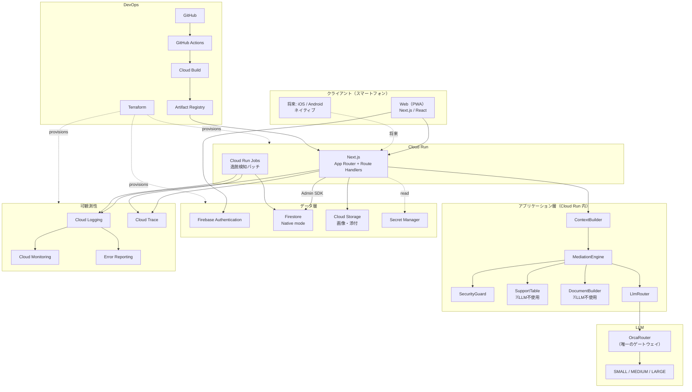

# 技術仕様書（Architecture） — Aida（あいだ）

| 項目 | 内容 |
| --- | --- |
| プロダクト名 | **Aida（あいだ）** ※仮称 |
| 作成日 | 2026-08-11 |
| 位置づけ | テクノロジースタック・開発ツール・技術制約・パフォーマンス要件を定義する恒久ドキュメント |
| 前提 | [product-requirements.md](product-requirements.md) / [functional-design.md](functional-design.md) |

---

## 1. 技術選定の方針

### 1.1 選定原則

1. **C1（メッセージを跨がせない）を、アプリ層だけでなくインフラ層でも担保する** — データストアのアクセス制御を独立した防御層として使う
2. **LLM の入口を1箇所に集約する** — OrcaRouter を唯一のゲートウェイとし、モデル選択・コスト計測・監査をそこで完結させる
3. **金額と法的条項の生成経路に LLM を置かない** — 算定表参照とひな形置換は決定的処理として実装する（P3）
4. **10年運用に耐えるデータ設計を優先する** — 合意は法的文書であり、マイグレーションで書き換えてはならない
5. **スマートフォン前提。将来のネイティブアプリ化で再設計しない** — API 境界を最初から分離する
6. **個人〜小規模チームで運用できる範囲に収める** — マネージドサービスを優先し、常時稼働リソースを持たない

### 1.2 採用 / 不採用の判断基準

| 判断軸 | 採用条件 |
| --- | --- |
| C1・非開示情報保護への寄与 | 直接寄与するなら優先的に採用 |
| マネージド度 | 運用者がゼロでも回ること |
| コスト | **月額500円の市場アンカー下で粗利が成立すること**（→ §7） |
| 学習コスト | 既知技術の組合せを優先 |
| ネイティブ化への影響 | 将来の iOS / Android 移行を妨げないこと |

---

## 2. テクノロジースタック

### 2.1 全体図



### 2.2 レイヤ別技術一覧

#### 2.2.1 フロントエンド

| 項目 | 採用技術 | 補足 |
| --- | --- | --- |
| フレームワーク | **Next.js（App Router）** | UI と API を1リポジトリで扱う |
| 言語 | **TypeScript** | strict |
| スタイル | **Tailwind CSS** | モバイル前提（390×844 基準） |
| 配信形態 | **Web（PWA）** | ホーム画面追加・プッシュ通知に対応 |
| ダークモード | `prefers-color-scheme` ＋ 明示切替 | **必須**（夜間利用が想定される） |
| 将来 | iOS / Android ネイティブ | API 境界を維持し再設計を避ける |

#### 2.2.2 サーバー（BFF 兼アプリケーション層）

| 項目 | 採用技術 | 補足 |
| --- | --- | --- |
| 実行環境 | **Cloud Run** | 最小インスタンス 0。常時稼働コストを持たない |
| API 実装 | Route Handlers ＋ Server Actions | §7 の API 設計に対応 |
| リージョン | **asia-northeast1（東京）** | |
| バッチ | **Cloud Run Jobs ＋ Cloud Scheduler** | 逸脱検知・リマインダー送信（日次） |

#### 2.2.3 LLM レイヤ

| 項目 | 採用技術 | 補足 |
| --- | --- | --- |
| ゲートウェイ | **OrcaRouter** | **唯一の LLM 入口。**モデル選択・コスト計測・監査を集約 |
| ルーティング | 自前の `LlmRouter` | 用途 → 階層（SMALL/MEDIUM/LARGE）を決定（→ §4） |
| 構造化出力 | JSON Schema（`PayloadSchema.schema`） | payload 生成時の型指定 |
| 金額算定 | **LLM 不使用**（算定表の決定的参照） | P3 |
| 条項生成 | **LLM 不使用**（ひな形置換） | P3 / NFR-03 L-1 |

> **LLM 呼び出しは `LlmRouter` を経由しないものを一切作らない。**直接呼び出しを禁止することで、コスト計測（CT-1〜CT-4）と監査ログの欠落を防ぐ。

#### 2.2.4 データ層

| 項目 | 採用技術 | 補足 |
| --- | --- | --- |
| 認証 | **Firebase Authentication** | 招待コード＋認証。当事者の本人性はアプリ側で管理 |
| データベース | **Firestore（Native mode）** | ドキュメント指向。**セキュリティルールを独立した防御層として利用**（→ §5） |
| オブジェクトストレージ | **Cloud Storage** | 面会時の写真、学校からの連絡の画像など |
| Secret 管理 | **Secret Manager** | OrcaRouter API キー、Firebase Admin 鍵 |
| クライアントからの直接アクセス | **禁止（default deny）** | すべてサーバー経由（→ §5.2） |

#### 2.2.5 DevOps・可観測性

| 項目 | 採用技術 | 補足 |
| --- | --- | --- |
| バージョン管理 | **GitHub** | |
| CI | **GitHub Actions** | lint / typecheck / test / **不変条件テスト**（→ §5.3） |
| CD | **Cloud Build** | ビルド → Artifact Registry → Cloud Run |
| コンテナレジストリ | **Artifact Registry** | |
| IaC | **Terraform** | 状態は GCS バックエンド |
| ロギング | **Cloud Logging** | 構造化ログ |
| メトリクス | **Cloud Monitoring** | レイテンシ・エラー率・**LLM 階層別コスト** |
| トレース | **Cloud Trace** ＋ OpenTelemetry | 調停パイプラインの各ステップを可視化 |
| エラー追跡 | **Error Reporting** | |

#### 2.2.6 開発ツール

| 項目 | 採用技術 |
| --- | --- |
| パッケージ管理 | **pnpm** |
| Lint | ESLint（Next.js Strict ＋ @typescript-eslint） |
| フォーマット | Prettier |
| 型チェック | `tsc --noEmit` |
| テスト | Vitest（単体・不変条件） / Playwright（E2E） |
| Firestore ルールのテスト | `@firebase/rules-unit-testing` |

---

## 3. データストア設計（Firestore）

### 3.1 コレクション構造

```
/cases/{caseId}
   ├ /parties/{partyId}
   ├ /children/{childId}
   ├ /consultations/{consultationId}
   │     └ /messages/{messageId}        ← partyId フィールドを持つ
   ├ /agreementItems/{itemId}
   │     └ /revisions/{revisionId}
   ├ /proposals/{proposalId}
   ├ /adjustments/{adjustmentId}
   ├ /mediationEvents/{eventId}         ← toPartyId フィールドを持つ
   ├ /notifications/{notificationId}
   └ /obligations/{obligationId}
         ├ /fulfillments/{id}
         └ /deviations/{id}

/contactInfo/{partyId}                  ← ★ケース配下に置かない（§3.2）

/masters/topicCategories/{id}
/masters/scenarios/{id}
/masters/payloadSchemas/{id}
/masters/clauseTemplates/{id}

/llmCallLogs/{id}                       ← コスト計測（§4.3）
```

### 3.2 ★ ContactInfo をケース配下に置かない

非開示情報（住所・電話・勤務先）を `/cases/{caseId}/...` の下に置くと、**ケースへのアクセス権が誤って広がった瞬間に相手の個人情報まで到達可能になる。**

そこで `/contactInfo/{partyId}` を**独立したルートコレクション**とし、`partyId` 本人以外はいかなる経路でも到達できないようにする。

> **パスの設計そのものが FR-09（非開示情報の分離）の実装である。**

### 3.3 リレーショナルモデルからの写像

[functional-design.md §4](functional-design.md) の ER をドキュメント指向に写す際の方針。

| 元の関係 | Firestore での表現 | 理由 |
| --- | --- | --- |
| Case → Party / Child / Consultation | **サブコレクション** | 常にケース単位で読む |
| Consultation → Message | **サブコレクション** | 相談単位でコンテキストを組む（§4.2） |
| AgreementItem → Revision | **サブコレクション** | 履歴は追記のみ |
| Proposal / Adjustment | ケース直下のコレクション ＋ `agreementItemId` フィールド | 論点横断で引くことがある |
| マスタ類 | **ルートの `/masters`** | ケースに依存しない。全ケースで共有 |
| PayloadSchema の参照 | `payloadSchemaId` を**文字列で保持** | 参照整合はアプリ層とテストで担保 |

**トランザクションが必要な箇所**

| 操作 | 理由 |
| --- | --- |
| 恒久的変更の確定 | `AgreementItem` 更新 ＋ `AgreementRevision` 追加 ＋ `Obligation` 再生成を不可分に行う |
| 合意の確定 | `AgreementItem` 更新 ＋ `Obligation` 生成 |

Firestore のトランザクションは同一データベース内で成立するため、いずれも1トランザクションで完結する。

---

## 4. LLM ルーティングとコスト計測

### 4.1 階層の抽象化

OrcaRouter の利用可能モデルと単価は設定で差し替える（→ §9 の未確定事項）。

```ts
enum ModelTier { SMALL, MEDIUM, LARGE }

type TierConfig = {
  model: string
  inputPricePerMTok: number
  outputPricePerMTok: number
}
```

### 4.2 用途と階層の割り当て

| 用途 | 階層 | 頻度 | 備考 |
| --- | --- | --- | --- |
| 意図分類・危険検知 | **SMALL** | 全メッセージ（最高） | 出力が短く定型 |
| 提案の構造化 | **SMALL** | 高 | JSON Schema による構造化出力 |
| 感情の受け止め | **MEDIUM** | 中 | 相手に届かない領域 |
| 事情の抽出・再構成 | **MEDIUM** | 中 | ホワイトリスト適用（§5.1a） |
| 相手への中立文の生成 | **MEDIUM** | 中 | |
| 調停案の生成 | **LARGE** | **低**（論点ごとに1〜数回） | 説明文のみ生成。金額は算定表由来 |
| 条項の生成 | **なし** | — | ひな形置換 |
| 金額の算定 | **なし** | — | 算定表参照 |

**1メッセージあたりの標準的な呼び出し**

| 階層 | 回数 |
| --- | --- |
| SMALL | 2 |
| MEDIUM | 2 |
| **LARGE** | **0** |

> **頻度と単価が逆相関する。**LARGE は論点ごとに数回しか発生しないため、往復が増えても原価はほぼ SMALL / MEDIUM で決まる。

### 4.3 コスト計測

すべての LLM 呼び出しを `/llmCallLogs` に記録する。

| フィールド | 内容 |
| --- | --- |
| `caseId` / `consultationId` | どの相談か |
| `purpose` | 用途（意図分類、調停案生成 …） |
| `tier` | SMALL / MEDIUM / LARGE |
| `inputTokens` / `outputTokens` | 実測値 |
| `costJpy` | 単価から算出 |

| 目標 | 算出方法 |
| --- | --- |
| **CT-1** メッセージ単価 | `SUM(costJpy) / COUNT(message)` |
| **CT-2** 世帯あたり月額原価 | ケース単位の月次集計 |
| **CT-3** 月額500円下での粗利 | 課金額 − CT-2 |
| **CT-4** ルーティングなしとの比較 | **同じログの `inputTokens` / `outputTokens` に LARGE の単価を掛け直す**。実測ベースで削減率を出せる |

> **CT-4 が実測で出せることが重要。**「ルーティングにより原価を◯%削減」を推測ではなく計測値として提示できる。

---

## 5. セキュリティ

### 5.1 5層防御

C1 と非開示情報保護を、**アプリ層だけに依存させない**。

| 層 | 対策 | 実装場所 |
| --- | --- | --- |
| **L0. データストア** | **Firestore セキュリティルール（default deny）** | `firestore.rules` |
| **L1. 構造** | ContextBuilder の許可リスト。`buildRelayContext` は `partyId` を引数に取らない | アプリ |
| **L2. 入力** | 意図分類による `INFO_QUERY` 検知、指示上書き試行のパターン検知 | アプリ |
| **L3. 境界** | ユーザー入力を区切りで囲み、データとして扱うことを明示 | プロンプト |
| **L4. 出力** | PII 検出（正規表現 ＋ DB 既知値との照合）。検出時はブロックして再生成 | アプリ |

### 5.2 ★ L0：クライアントからの直接アクセスを禁止する

**Firestore へのクライアント直アクセスは一切許可しない。**Firebase SDK は**認証のみ**に使用し、データ操作はすべて Cloud Run 上の Admin SDK 経由とする。

```
// firestore.rules（方針）
match /{document=**} {
  allow read, write: if false;     // クライアントからは全面拒否
}
```

**この設計の意味**

| | |
| --- | --- |
| 通常時 | すべてのアクセスが API 層を通り、スコープ規約 A-1〜A-4（→ functional-design.md §7.6）が適用される |
| **最悪ケース** | モバイルアプリから Firebase 設定値を抽出して直接クエリしても、**ルールが拒否するため相手のデータに到達できない** |

> **アプリ層のバグが即座に情報漏洩にならない。**L0 と L1 が独立しているため、片方が破れても他方が残る。

### 5.3 CI に組み込む検証

以下を GitHub Actions の必須ジョブとする。**通らなければマージできない。**

| # | 検証 | 対応 |
| --- | --- | --- |
| 1 | **不変条件テスト** INV-1〜INV-4 | functional-design.md §4.10 |
| 2 | **Firestore ルールのテスト**（クライアントから全コレクションが読めないこと） | §5.2 |
| 3 | **`ClauseTemplate` のプレースホルダ整合**（G-3） | functional-design.md §4.9 |
| 4 | `LlmRouter` を経由しない LLM 呼び出しがないこと（静的検査） | §2.2.3 |
| 5 | シークレットのコミット検出（gitleaks 等） | — |

### 5.4 シークレット管理

- すべて **Secret Manager**。Cloud Run 起動時にサービスアカウント経由で読み込む
- リポジトリに `.env` を含めない。`.env.example` のみ
- OrcaRouter API キーは**サーバー側のみ**。クライアントに渡さない

### 5.5 ログの取り扱い

| 対象 | 方針 |
| --- | --- |
| `Message.content`（原文） | **ログに出力しない。**Firestore にのみ保存 |
| `ContactInfo` | **ログに出力しない** |
| LLM のプロンプト・応答 | **本文を出さない。**トークン数・階層・用途・所要時間のみ記録 |
| エラー | スタックトレースは記録。ユーザー入力は含めない |

> **可観測性のためにプライバシーを犠牲にしない。**デバッグに本文が必要な場合は、開発環境の合成データで再現する。

---

## 6. 環境構成

### 6.1 環境一覧

| 環境 | 用途 | デプロイ | 備考 |
| --- | --- | --- | --- |
| local | 開発 | — | Firestore Emulator ＋ OrcaRouter のモック |
| dev | 動作確認 | `main` への push | Cloud Run（最小 0） |
| prod | 本番 | `v*` タグ | Cloud Run（最小 0） |

### 6.2 主要な環境変数

| 変数名 | 用途 | 配置 |
| --- | --- | --- |
| `GOOGLE_CLOUD_PROJECT` | プロジェクト ID | server |
| `ORCAROUTER_API_KEY` | OrcaRouter 認証 | **server のみ**（Secret Manager） |
| `ORCAROUTER_BASE_URL` | エンドポイント | server |
| `MODEL_TIER_SMALL` / `_MEDIUM` / `_LARGE` | 階層 → モデル ID | server |
| `PRICE_*_INPUT` / `PRICE_*_OUTPUT` | 階層別単価（コスト計算用） | server |
| `FIREBASE_PROJECT_ID` / `FIREBASE_CLIENT_EMAIL` / `FIREBASE_PRIVATE_KEY` | Admin SDK | server |
| `NEXT_PUBLIC_FIREBASE_*` | クライアント認証設定 | client（公開可） |

### 6.3 リージョン

- **asia-northeast1（東京）**
- 個人情報を扱うため、データの所在地を国内に限定する

---

## 7. パフォーマンス・コスト要件

### 7.1 応答時間

| 操作 | 目標 |
| --- | --- |
| 意図分類 ＋ 感情の受け止め（初回応答） | **3秒以内** |
| 相手への取次ぎ生成 | 10秒以内（非同期でよい） |
| 調停案の生成 | 30秒以内（「検討中」表示を出す） |
| 合意状態の表示 | 1秒以内 |

> **初回応答の速さを最優先する。**感情的な状態で入力した直後に無反応だと、体験が崩れる。取次ぎと調停は非同期でよい。

### 7.2 コスト設計

| 前提 | 値 |
| --- | --- |
| 市場の価格アンカー | **月額500円**（→ product-requirements.md §5.2） |
| 収益構造 | 入口の一時課金 ＋ 継続の月額（二階建て） |

**継続課金層で粗利が成立する原価に収めることを設計目標とする（CT-3）。**

| コスト要素 | 抑制方法 |
| --- | --- |
| LLM | 階層ルーティング（§4.2）。高頻度処理を SMALL に寄せる |
| コンピュート | Cloud Run 最小インスタンス 0 |
| データベース | Firestore の従量課金。相談単位でコンテキストを絞り読み取り量を抑える |
| バッチ | Cloud Run Jobs（日次のみ） |

### 7.3 スケーラビリティ

- Cloud Run のオートスケール（最大インスタンス数で上限を設定）
- Firestore はケース単位でシャーディングされるため、ケース数の増加に対して線形

---

## 8. 可観測性

### 8.1 トレース設計

調停パイプラインの各ステップをスパンとして記録する。

```
consultation.postMessage
 ├─ classify.intent          [SMALL]
 ├─ respond.emotional        [MEDIUM]
 ├─ extract.context          [MEDIUM]
 ├─ structure.proposal       [SMALL]
 └─ relay.generate           [MEDIUM]

agreement.mediate
 ├─ supportTable.lookup      [LLM不使用]
 └─ generate.mediation       [LARGE]
```

**どのステップで時間と費用がかかっているかを、階層とセットで可視化する。**

### 8.2 メトリクス

| メトリクス | 用途 |
| --- | --- |
| LLM 階層別の呼び出し回数・トークン数・費用 | CT-1〜CT-4 |
| 合意成立率 | product-requirements.md §4.2 |
| 調停エスカレーション率 | 同上 |
| PII 検出によるブロック回数 | **0 でないなら設計を見直す** |
| INV 違反の検出回数 | **常に 0 であるべき** |

### 8.3 アラート

| 条件 | 通知 |
| --- | --- |
| PII 出力フィルタ（L4）が発火 | **即時**。L0〜L1 が破れている可能性 |
| 5xx 率の上昇 | 通常 |
| LLM 原価が想定を超過 | 日次 |

---

## 9. 技術的制約と未確定事項

### 9.1 制約

| # | 制約 |
| --- | --- |
| 1 | **LLM 呼び出しは OrcaRouter 経由に限る。**直接呼び出しを作らない |
| 2 | **金額と条項の生成に LLM を使わない**（P3 / NFR-03 L-1） |
| 3 | **クライアントから Firestore へ直接アクセスしない**（§5.2） |
| 4 | **原文と非開示情報をログに出さない**（§5.5） |
| 5 | データの所在地を国内（asia-northeast1）に限定する |

### 9.2 未確定事項

| # | 内容 | 影響 |
| --- | --- | --- |
| A-01 | **OrcaRouter の利用可能モデル・単価・レート制限** | §4.1 の階層設定、CT-1〜CT-4 の算出 |
| A-02 | OrcaRouter の構造化出力（JSON Schema）対応可否 | 対応しない場合、payload 生成の方式を変更する必要がある |
| A-03 | 本人確認の方式（招待コードのみか、eKYC を要するか） | §2.2.4 認証 |
| A-04 | プッシュ通知の実装（Web Push / FCM） | 通知に本文を出さない要件との整合 |
| A-05 | 添付ファイル（写真）のスキャン方針 | Cloud Storage の運用 |

> **A-01 は最優先。**これが確定しないと §4 のコスト設計が数値として成立しない。
