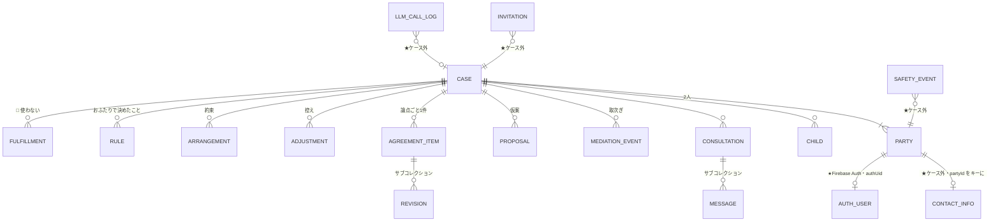

# データモデル（2026-08-14 時点）

- ★**実装から起こした**（`caseRepository.ts` / `invitationRepository.ts` / `masterRepository.ts` / `llmCallLogRepository.ts`）
- 設計の意図は `functional-design.md` §4。**本書は「いま何があるか」**

---

## 1. 全体像



---

## 2. コレクションの一覧

### 2.1 ケースの中（`cases/{caseId}/…`）

| コレクション | キー | 中身 | 備考 |
| --- | --- | --- | --- |
| `parties` | `partyId` | `authUid` / `role` / `incomeBand` / `state` / `displayNameForOther` | ★**精密な年収は入れない**（INV-2a） |
| `children` | 自動 | `birthDate` | ★氏名を持たない |
| `consultations` | `consultationId` | `scenarioId` / `threadId` / `title` / `initiatedBy` | ★**当事者ごとに分かれる**（§3.1） |
| `consultations/{id}/messages` | 自動 | `partyId` / `role` / `content` / `relayed` | ★**常に PRIVATE。相手から読む経路が無い** |
| `mediationEvents` | 自動 | `fromPartyId` / `toPartyId` / `content` / `threadId` | ★**取次ぎ。ここだけが越える** |
| `proposals` | 自動 | `byPartyId` / `topic` / `payload` / `sharedAt` / `withdrawnAt` / `effect` | ★仮案（§3.2） |
| `agreementItems` | **`topic`** | `status` / `payload` / `consents` / `agreedAt` / `version` | ★論点ごとに**1件**（ID が topic そのもの） |
| `agreementItems/{topic}/revisions` | 自動 | `fromVersion` / `previousPayload` | 改訂の履歴 |
| `adjustments` | 自動 | `topic` / `change` / `byPartyId` / `effect` / `kind` / `threadId` | ★**2つの用途が同居**（§3.3） |
| `arrangements` | 自動 | `date` / `label` / `byPartyId` / `threadId` | 約束（日付つき） |
| `rules` | 自動 | `kind` / `byPartyId` / `value` | ★おふたりで決めたこと（公正証書に入らない） |
| `fulfillments` | 自動 | — | 🚫 **書かない・読まない**（履行の記録をやめた） |

### 2.2 ケースの外（ルート直下）

| コレクション | キー | なぜケース外か |
| --- | --- | --- |
| **`contactInfo`** | **`partyId`** | ★**SELF_ONLY。**住所・電話・勤務先・**精密な年収**。<br>ケース配下に置くと、ケースを読む経路から漏れうる |
| `invitations` | `token` のハッシュ | 受諾前はケースの当事者ではない |
| `safetyEvents` | 自動 | ★**運営が読む。**当事者の画面から読ませない |
| `llmCallLogs` | 自動 | 原価の集計（CT-1〜CT-4） |
| `masters/*/items` | 各 id | シナリオ・分類・算定表・条項ひな形・payload スキーマ・ナレッジ・窓口 |

★ **Firebase Auth**（Firestore の外）にメールアドレス。**Firestore には無い。**

---

## 3. ★ 押さえておくべき3点

### 3.1 相談は、当事者ごとに分かれている

```
consultations/cons_{partyId}_{threadId}   ← ★ID に partyId が入る
  └ messages/                             ← その人のものだけ
```

**同じスレッドでも、AさんとBさんで別のドキュメント**である。
**セッションが跨がらない構造そのもの**が C1 の土台になっている。

### 3.2 仮案（`proposals`）は、3つの時刻で状態が決まる

| | 意味 |
| --- | --- |
| `sharedAt = null` | **下書き。**★相手に見えない（サーバ側で落とす） |
| `sharedAt` あり | 渡してある |
| `withdrawnAt` あり | 取り下げた。★相手からは消えるが、**取り下げたことは伝わる** |

合意は `agreementItems.consents` が**双方 ACCEPTED、かつ payload が一致**したときだけ成立する。

★ 了承では **payload をサーバが複製する**ので、一致は構造的に保証される。

### 3.3 ★ `adjustments` に、2つの用途が同居している

| 書く関数 | 付ける印 | 読む関数 | 出る場所 |
| --- | --- | --- | --- |
| `appendAdjustment` | `kind: "ADJUSTMENT"` ＋ `threadId` | `listAdjustmentsByThread`（`kind` で絞る） | 相談の中「お話し合いの内容」 |
| `appendException` | `effect: "ONE_TIME"`（★`kind` なし） | `listExceptions`（`effect` で絞る） | 決まったこと「今回だけ」 |

**同じコレクションを、別の条件で引いている。**

> ★ **いま `appendException` に到達する経路がない。**
> `applyAdjustment(ONE_TIME)` からしか呼ばれず、
> `terms` API が作る仮案は `effect: "PERMANENT"` のみだからである。
> → **「決まったこと」の「今回だけ」は、一度も表示されない。**
>
> 相談から作られる控えは `appendAdjustment`（`kind: "ADJUSTMENT"`）に入っており、
> **こちらは「決まったこと」から読んでいない。読む先が食い違っている。**

---

## 4. 識別子

| 識別子 | 発行 | 範囲 | 失うと |
| --- | --- | --- | --- |
| `caseId` | ケース作成時 | — | — |
| `partyId` | ケース作成／受諾時 | **ケースの中だけ** | — |
| **セッション Cookie** | ケース作成／受諾／サインイン時 | 端末 | ★**登録前は、これが唯一の手がかり** |
| `authUid` | **メール登録時** | 横断（`collectionGroup` で引ける） | Auth を消すと辿れない |

### ★ 登録前は、Cookie を失うと辿れない

```
「はじめる」→ caseId / partyId 発行、Cookie 発行
              ★この時点では authUid が無い
              ↓
       Cookie を失う → **そのケースは、誰のものか分からない**
```

**実測（2026-08-14）：70ケース中 30ケースが、誰も登録していない状態。**

匿名で始められることの裏返しである。`userId` を新しく発行しても、
**その userId を持つのも Cookie なので、この性質は変わらない。**

★ メール登録が「初めて辿れるようになる点」であり、
だから**オンボーディングの2枚目に置いてある。**

### 同じ人が複数のケースを持つ場合

`partyId` はケースごとに別、`contactInfo` は `partyId` キーなので、
**引き継がれない。**

★ 実測では **79の識別子すべてが1ケースずつ**で、まだ起きていない。
起きたときは、退会（U-07）の設計と一緒に決める必要がある。

---

## 5. 越えるもの・越えないもの（C1）

```
Aさんが書いた原文
   └ consultations/{A}_{thread}/messages    ★Aのものにしか入らない
          ↓ 抽出・検査（domain/relay）
   mediationEvents { toPartyId: B }         ★ここだけが越える
```

| | 越えるか |
| --- | --- |
| 原文（`messages.content`） | **越えない。**Bのスコープから読む経路が構造上ない |
| 取次ぎ（`mediationEvents.content`） | **越える。**伝聞形・逐語一致は落とす（INV-4a） |
| 仮案（`proposals.payload`） | **渡したときだけ**越える（`sharedAt`） |
| 精密な年収（`contactInfo.annualIncome`） | **越えない。**越えるのは `parties.incomeBand`（帯）だけ |
| 住所・電話・勤務先 | **越えない。**そもそもケース配下に無い |
| メールアドレス | **越えない。**Firestore に無い |
